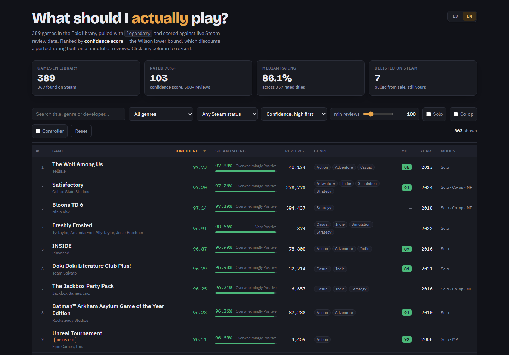

# Epic Backlog Triage

Pulls your Epic Games library with [legendary](https://github.com/derrod/legendary) and scores every
title against live Steam review data, so you can pick something to play instead of scrolling a
launcher full of free-giveaway games you have never opened.

The output is `out/report.html`: one self-contained page, sortable and filterable, that works
offline and needs no server. It reads in English or Spanish — it opens in whichever your system
is set to, and the `ES`/`EN` switch at the top right overrides that and remembers the choice.
Nothing in this repository is specific to the person who wrote it — clone it, connect your own
Epic account, and you get your own library ranked the same way.



The top of one real library. Every number on the page came from Steam that morning; the row
ranked ninth is a game Steam no longer sells.

## What you need

| | |
|---|---|
| **Python 3.8 or newer** | Everything here is standard library only |
| **An Epic Games account** | Read-only: the library listing, nothing else |
| **About an hour, once** | Every HTTP response is cached, so later runs take seconds |

Windows, macOS and Linux all work. The Epic Games Launcher does **not** need to be installed.

## Quick start (Windows)

Download or clone the repository, then **double-click `run.bat`**. It performs every step in the
next section for you:

1. finds a Python 3.8+ — the `py` launcher first, so it never trips over the Microsoft Store stub
2. builds a private `.venv` inside the folder, touching nothing else on the machine
3. installs legendary into it
4. runs the test suite over itself — offline and silent unless something is broken, so a bad
   checkout stops here rather than an hour into fetching
5. opens the Epic login the first time, and skips straight past it on every run after
6. fetches your library and the Steam data, retries the titles that did not match, and settles
   which of the rest are delisted
7. renders `out/report.html`, prints the delisted count, and opens the page in your browser

Run it as often as you like: it reuses the environment and the cache, so a second run takes seconds
rather than an hour. Anything you pass goes through to the fetch step, so `run.bat --refresh`
re-reads your Epic library instead of the cached copy.

If a step fails it stops there and says what to do about it, and the window stays open so you can
read it.

## Setup by hand

Do this on macOS and Linux, or on Windows if you would rather drive it yourself.

### 1. Get the code and install legendary

```sh
git clone <this-repo-url>
cd "Epic Games List"

python -m venv .venv
# Windows (PowerShell):  .venv\Scripts\Activate.ps1
# macOS / Linux:         source .venv/bin/activate

python -m pip install -r requirements.txt
```

On macOS and Linux, use `python3` wherever this README says `python`.

The virtual environment is optional — `python -m pip install --user legendary-gl` works too. If you
skip the venv and your shell then cannot find the `legendary` command, the scripts fall back to
running it through the same interpreter, so it still works.

### 2. Connect your Epic account

This is the one step that is yours rather than the repo's.

```sh
legendary auth
```

That opens Epic's login page. Log in, and legendary stores the token itself.

If the embedded browser is unavailable — common on servers and bare Linux installs — legendary
falls back to asking for a code. You can also do that half manually:

1. Open **<https://legendary.gl/epiclogin>** in any browser and log into Epic.
2. The page answers with a small blob of JSON containing an `authorizationCode` value.
3. Hand that code over:

```sh
legendary auth --code <authorization code>
```

The code is single-use and expires within minutes, so grab it and paste it straight away. If it has
already expired, reload the login URL for a fresh one.

Already have the Epic Games Launcher installed and signed in? `legendary auth --import` takes the
session from it instead — note that this signs the launcher itself out.

Confirm it worked:

```sh
legendary status
```

It should print your Epic display name. Your credentials live in legendary's own config directory
(`%USERPROFILE%\.config\legendary` on Windows, `~/.config/legendary` elsewhere) — never in this
repository.

### 3. Build the report

```sh
python epic_steam.py      # library -> Steam data        -> out/games.json, out/games.csv
python second_pass.py     # retry the titles that missed    (optional, recommended)
python build_report.py    # render                       -> out/report.html
```

Then open `out/report.html` in a browser.

The first `epic_steam.py` run is slow on purpose: Steam's endpoints are rate limited, so requests
are throttled and every response is written to `cache/`. Rerun it any time — it re-reads the cache
and finishes in seconds.

Flags for `epic_steam.py`:

| Flag | Effect |
|---|---|
| `--refresh` | Re-query legendary instead of reusing the cached library dump |
| `--no-hltb` | Skip the HowLongToBeat phase entirely |

## Reading the report

Everything is inside the one file: no server, no build step, no dependencies. Open it from disk,
mail it to yourself, carry it on a stick. The only thing it asks the network for is its webfonts,
and every rule names a system fallback, so offline it just looks slightly plainer.

**The filters stack.** The search box matches title, genre, developer and publisher; the two
dropdowns narrow by genre and by Steam status; the *min reviews* slider steps through 0, 100, 500,
2,000, 10,000 and 50,000, and opens at 100; Solo, Co-op and Controller keep only the games that
declare support for them. **Reset** clears the lot. Sort from the dropdown or by clicking a column
heading, and click it again to flip the direction.

**English or Spanish.** The page opens in whichever language your browser asks for — on Windows
that follows the system display language — and the `ES`/`EN` switch at the top right overrides it.
The choice is remembered in that browser for next time. Switching translates the interface, Steam's
genre names and its review tiers (*Very Positive* becomes *Muy positivas*), and reformats numbers
and dates for the locale: 308,000 reviews become 308.000, 92.50% becomes 92,50 %, and the fetch
date in the footer is written out the Spanish way. Titles, developers and publishers are left
alone — they are names, not text. Filtering and sorting are unaffected: the genre dropdown shows
translated names but still matches on what Steam actually sent.

## What lands where

```
out/report.html   the page you actually look at
out/games.json    every field, one object per game
out/games.csv     the same rows, for a spreadsheet
cache/            one JSON file per HTTP response, plus your library dump
```

`out/` and `cache/` are both generated, and both are in `.gitignore` — your library never ends up in
a commit, and a clone of this repo carries no one else's data. Delete either directory at any time;
the scripts recreate what they need.

## How a game gets its numbers

1. **Library** — `legendary list --json -T`, keeping entries whose Epic categories include `games`
   or `software`. That drops the Unreal Engine assets, plugins and sample projects that share the
   account, while keeping oddities like RPG in a Box that Epic files under software.
2. **Match** — each title goes through Steam's storefront search endpoint. Results are ranked by how
   exactly the name matches (exact, then edition-stripped, then substring), and candidates that turn
   out to be DLC, soundtracks or demos are rejected in favour of the base game.
3. **Enrich** — `store.steampowered.com/appreviews/<id>` for the review split, and `api/appdetails`
   for genre, Metacritic, release date, developer and player modes. Requests are throttled to stay
   inside Valve's rate limit and retried with backoff on 429.
4. **Second pass** — `second_pass.py` takes the titles that came back empty and walks a ladder of
   looser queries: drop `(Beta)` markers, drop the subtitle, strip punctuation, split
   `KillingFloor2Beta` into words. Matches are still name-checked before being accepted, and two
   Epic entries that land on the same Steam page are de-duplicated.
5. **Verdict** — anything still unmatched is looked up on PCGamingWiki. Steam's search only
   answers for games it currently sells, so a delisted game and one that was never on Steam are
   both simply absent from it; the wiki carries an article either way, with the Steam appid in
   its infobox when there is one. That appid is enough, because `appdetails` and `appreviews`
   keep answering for a pulled game long after the store stops offering it.

## Why a game has no score

Every row carries a `steam_status`, so a blank Steam column says which of these it is rather than
lumping them together:

| Status | Meaning |
|---|---|
| `listed` | On sale on Steam now, or free to play |
| `delisted` | Pulled from sale, but the page and its reviews survive — **scored and ranked like any other game**, since you still own it on Epic |
| `not-on-steam` | PCGamingWiki has an article and it lists no Steam appid: it was never there |
| `duplicate` | A second Epic entry for a game already in the list — a test branch, a beta, an edition — naming the row that holds the data |
| `unreleased` | Steam has a page, dated in the future |
| `unknown` | Nothing found either way |

Pick one from the **Any Steam status** dropdown in the report to see just those. Choosing a status
lifts the *min reviews* floor for rows that have no reviews to count, so the categories that are
blank by nature do not stay invisible.

Delisted games are detected from what `appdetails` stops returning: a pulled title keeps its page,
metadata and reviews, and loses every package, package group and price. Free-to-play games have no
packages either, so they are separated by `is_free`, and an unreleased date is checked first.

A wiki match is weaker than a Steam search hit and is marked as such — hover the badge to see which
Steam page it landed on. Where a name is reused across releases it can pick the wrong one: Epic's
free *Unreal Tournament* is the 2014 game, and PCGamingWiki's plain `Unreal Tournament` article is
the 1999 one.

## The confidence score

Sorting by raw positive-review percentage puts *100% from 14 reviews* above *98% from 300,000*,
which is exactly backwards for deciding what to play. The `sort_score` column is instead the
**Wilson 95% lower bound** on the proportion of positive reviews:

```
         p + z²/2n - z·√( p(1-p)/n + z²/4n² )
score = ──────────────────────────────────────   ,  z = 1.96
                    1 + z²/n
```

It starts at the raw rating and pulls downward the fewer reviews there are, so a handful of glowing
reviews can no longer outrank a well-established favourite. Hades (98.01%, 308k reviews) barely
moves, to 97.96. A game at 100% on 14 reviews lands near 78.

## Playtime

Not included. HowLongToBeat's search endpoint now rejects direct requests with
`{"error":"Session expired or invalid fingerprint"}`, and this script does not forge a browser
session to get around that. `epic_steam.py` probes once, logs that it is unavailable, and moves on;
`build_report.py` drops the Hours column when no playtime data is present. If HLTB ever opens back
up, both halves light up again with no code changes.

## Troubleshooting

**`Could not run legendary`** — it is not installed in the interpreter you are running. Rerun
`python -m pip install -r requirements.txt` with the same `python` you use for the scripts.

**`legendary could not list your library`** — almost always authentication. Run `legendary status`;
if it does not show your display name, redo step 2.

**Lots of games with no Steam data** — if the network dropped mid-run, those failures are cached as
`null` and will not be retried. Clear the remembered failures and run again:

```sh
python -c "import json,glob,os; [os.remove(p) for p in glob.glob('cache/*.json') if json.load(open(p,encoding='utf-8')) is None]"
```

**Stale review counts** — delete `cache/reviews_*.json` and rerun `epic_steam.py`. That refreshes the
review numbers without re-resolving the whole library.

**A game matched to the wrong Steam page** — delete the corresponding `cache/search_<title>.json`
and rerun. Matching starts over for that title only.

**Garbled titles in the terminal** — the scripts switch stdout to UTF-8 on startup, but a terminal
stuck on a legacy code page can still draw the glyphs wrong. It is cosmetic; `out/games.json` and
the HTML report are UTF-8 regardless.

## Files

```
run.bat           Windows one-click: environment, self-check, login, fetch, report
epic_steam.py     phases 1-5: library -> match -> Steam -> playtime -> emit
second_pass.py    retries unmatched titles, then settles delisted vs never-there
pcgw.py           PCGamingWiki lookup: title -> Steam appid, for titles search hides
build_report.py   renders out/games.json into a sortable HTML page, in English and Spanish
steamlib.py       cached/throttled HTTP, name normalisation, Wilson score, store status
test_*.py         unit tests: matching, delisting, the report and its two languages
requirements.txt  legendary-gl (the scripts themselves are standard library only)
LICENSE           MIT
docs/             the screenshot at the top of this README
cache/            one JSON file per HTTP response      (generated, git-ignored)
out/              games.json, games.csv, report.html   (generated, git-ignored)
```

Run the tests with `python -m unittest discover`. They touch no network and no cache of yours.

## License

[MIT](LICENSE). Do what you like with the code. What it fetches is not covered by that licence:
the review numbers and store metadata are Valve's, and the article data is
[PCGamingWiki's](https://www.pcgamingwiki.com/wiki/PCGamingWiki:Copyrights). Both are read
through their public endpoints, at a rate their own limits allow, and cached locally rather than
redistributed.
